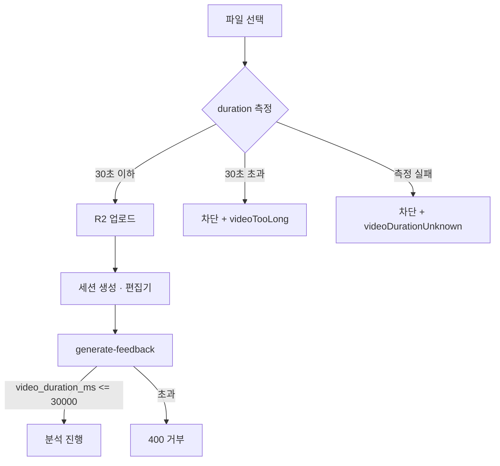

# 베타: 영상 30초 업로드 제한

FormFeed AI 베타(커뮤니티 공개) 기준으로, **30초를 초과하는 영상은 업로드할 수 없습니다.**  
“권장”이 아니라 **앱에서 차단**하는 정책입니다.

---

## 1. 왜 30초인가

| 목적 | 설명 |
|------|------|
| Gemini 비용·시간 | 전체 영상 분석 비용·처리 시간이 길이에 비례 |
| 동시 접속 | 10명 이상이 한꺼번에 올릴 때 429·타임아웃 완화 |
| 업로드 안정 | 용량·전송 시간 감소 → 모바일 끊김 감소 |
| 제품 UX | 팝업 2초 읽기·한 동작 클립 코칭에 맞는 길이 |

---

## 2. 사용자에게 보이는 규칙

- **최대 길이:** 30초 (초과 시 업로드 불가)
- **권장 길이:** 10~30초, 전신이 보이게
- **파일:** mp4, mov, webm · **최대 300MB** (기존과 동일)
- **안내 문구 예시:**  
  > 영상은 **30초 이내**만 업로드할 수 있습니다. 한 동작·한 구간만 올려 주세요.

---

## 3. 구현 요구사항 (개발 체크리스트)

### 3.1 클라이언트 — 업로드 **전** 차단

**파일:** [`app/page.tsx`](../app/page.tsx), 신규 [`lib/get-video-duration.ts`](../lib/get-video-duration.ts) (예정)

1. 사용자가 파일 선택
2. `URL.createObjectURL` + `<video>` `loadedmetadata`로 **duration(초)** 측정
3. `duration > 30` → 업로드·「피드백 만들기 시작」**비활성** + 에러 메시지
4. `duration`을 알 수 없으면 → “영상 정보를 읽을 수 없습니다. mp4로 다시 시도해 주세요.”

**상수 (권장):**

```ts
export const MAX_VIDEO_DURATION_SEC = 30;
export const MIN_VIDEO_DURATION_SEC = 1; // 선택: 너무 짧은 클립 거부
```

### 3.2 서버 — 분석 API 2차 방어

**파일:** [`app/api/ai/generate-feedback/route.ts`](../app/api/ai/generate-feedback/route.ts)

- 요청 body의 `video_duration_ms`가 **30_000 초과**이면 `400` + 한국어 에러
- 클라이언트 우회·잘못된 메타데이터 대비

### 3.3 사용자 메시지

**파일:** [`lib/user-messages.ts`](../lib/user-messages.ts) (예정)

| 키 | 문구 예시 |
|----|-----------|
| `videoTooLong` | 영상은 30초 이내만 업로드할 수 있습니다. |
| `videoDurationUnknown` | 영상 길이를 확인할 수 없습니다. mp4로 다시 선택해 주세요. |
| `videoTooShort` | (선택) 1초 미만 영상은 업로드할 수 없습니다. |

### 3.4 UI 문구 변경

| 위치 | 변경 전 | 변경 후 |
|------|---------|---------|
| 홈 업로드 안내 | 권장: 10~30초 | **최대 30초 (필수)** · 10~30초 권장 |

### 3.5 의도적 비포함 (베타)

- R2에 올라간 파일을 서버에서 다시 파싱해 길이 검증 (비용·복잡도)
- 업로드 API(`POST /api/upload/video`)에서 `fileSize` 외 duration 검증 (클라이언트가 duration을 보내지 않음)

---

## 4. 플로우



---

## 5. 커뮤니티·베타 공지용 문장

**게시글 / 랜딩에 넣을 한 줄:**

- 베타에서는 **30초 넘는 영상은 업로드되지 않습니다.** 짧은 한 동작 클립으로 시험해 주세요.
- 첫 AI 분석은 보통 **30초~1분** 걸릴 수 있습니다.

**피해야 할 표현:**

- “가능하면 30초以内” (실제로는 막히지 않으면 혼란)
- “무제한 길이”

---

## 6. 트레이너 FAQ

**Q. 1분 넘는 세트 영상은 안 되나요?**  
A. 베타는 **한 구간·한 동작** 피드백 검증용입니다. 유료/정식 버전에서 60~90초 확장 여부는 후기 폼 응답을 보고 결정합니다.

**Q. iPhone mov인데 길이가 안 잡혀요**  
A. mp4로보내기, 또는 파일을 다시 선택해 주세요. 브라우저가 duration을 읽지 못하면 업로드를 막습니다.

**Q. 29초인데 막혀요**  
A. 메타데이터 오차일 수 있습니다. 1~2초 짧게 자르거나 mp4로 변환 후 재시도해 주세요.

---

## 7. 관련 문서

- [Vercel 배포 체크리스트](./vercel-deploy.md)
- [R2 CORS 설정](./r2-cors-setup.md)

---

## 8. 구현 상태

| 항목 | 상태 |
|------|------|
| 문서 정의 | 완료 |
| 클라이언트 duration 검사 | 미구현 |
| generate-feedback duration 상한 | 미구현 |
| USER_MESSAGES | 미구현 |

구현 완료 후 이 표를 업데이트하세요.
